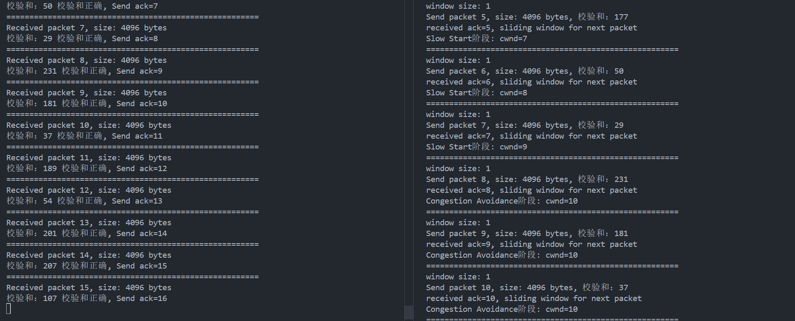
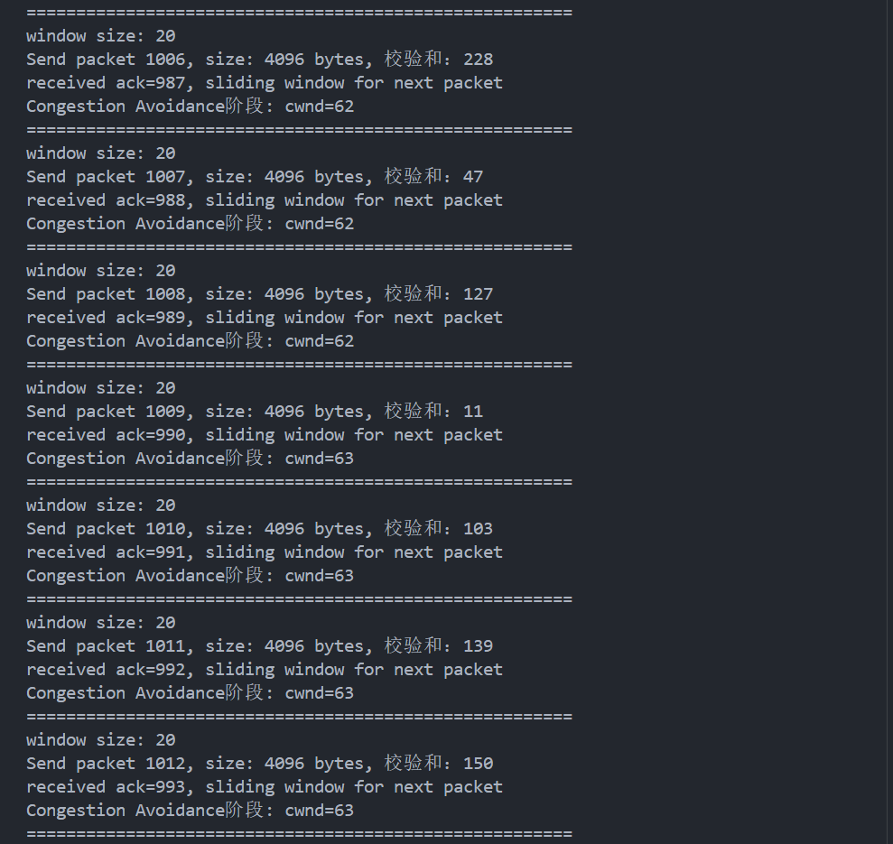
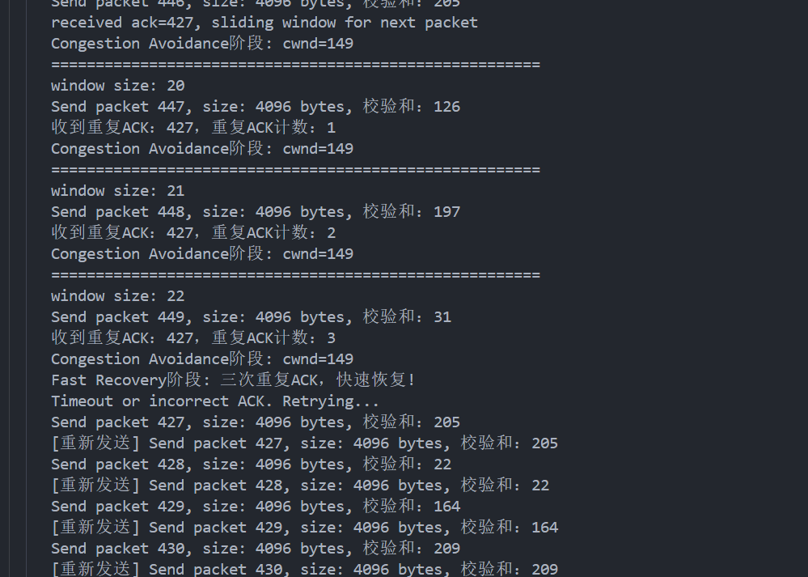
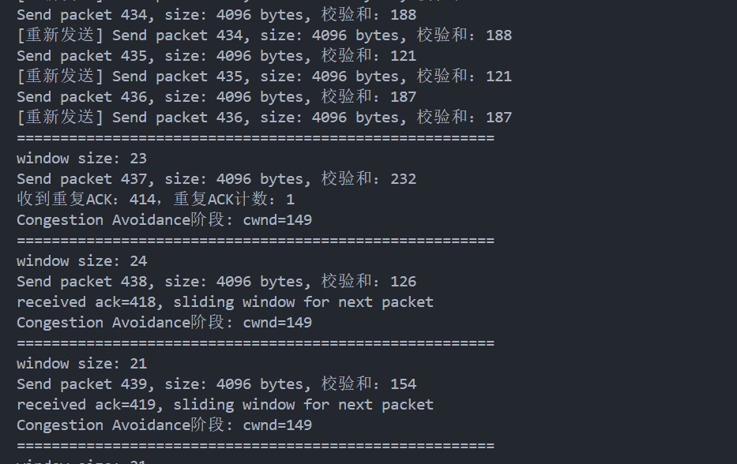
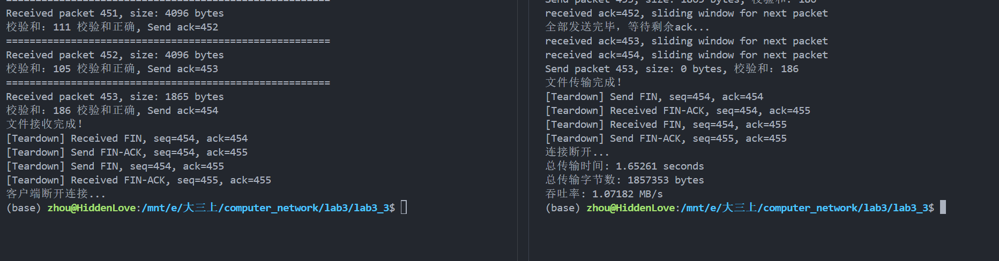
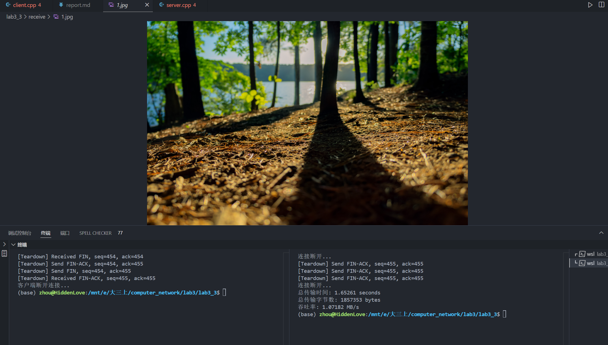

# 拥塞控制改进报告

- [拥塞控制改进报告](#拥塞控制改进报告)
    - [一、 拥塞控制原理](#一-拥塞控制原理)
        - [1. 慢启动（Slow Start）](#1-慢启动slow-start)
        - [2. 拥塞避免（Congestion Avoidance）](#2-拥塞避免congestion-avoidance)
        - [3. 快速恢复（Fast Recovery）](#3-快速恢复fast-recovery)
    - [二、 代码实现](#二-代码实现)
        - [1. 窗口变量](#1-窗口变量)
        - [2. 慢启动阶段](#2-慢启动阶段)
        - [3. 拥塞避免阶段](#3-拥塞避免阶段)
        - [4. 快速恢复阶段](#4-快速恢复阶段)
        - [5. 接收端错误处理](#5-接收端错误处理)
        - [6. 超时处理](#6-超时处理)
  - [三、 效果演示](#三-效果演示)
        - [1. 慢启动到拥塞避免](#1-慢启动到拥塞避免)
        - [3. 拥塞避免阶段](#3-拥塞避免阶段-1)
        - [3. 快速回复阶段](#3-快速回复阶段)
        - [4. 传输结果](#4-传输结果)
### 一、 拥塞控制原理
在网络通信中，拥塞控制是一项至关重要的技术，用于防止网络因过多的数据包涌入而导致的性能下降。本实验的目标是优化基于滑动窗口机制的传输协议，在此基础上添加入拥塞控制算法。报告中展现所实现的具体拥塞控制算法，相应的代码实现，以及效果展示。

拥塞控制的主要任务是在保证高效数据传输的同时，避免过多的数据包涌入网络，造成网络拥塞。TCP协议中的经典拥塞控制算法包括慢启动（Slow Start）、拥塞避免（Congestion Avoidance）和快速恢复（Fast Recovery）。这些机制通常与滑动窗口配合使用，控制每次可发送的数据量。

##### 1. 慢启动（Slow Start）
在慢启动阶段，拥塞窗口（`cwnd`）从1开始，并随着每次收到确认（ACK）而快速增长。这一过程持续到`cwnd`达到一个阈值（`ssthresh`），此时算法转向拥塞避免阶段。

##### 2. 拥塞避免（Congestion Avoidance）
当`cwnd`达到`ssthresh`后，拥塞控制进入拥塞避免阶段。在这个阶段，`cwnd`会线性增长，通常每收到一个ACK确认，这里我`cwnd`每次增长```MSS*(MSS/cwnd)```。

##### 3. 快速恢复（Fast Recovery）
当发生丢包时，TCP会通过快速恢复机制来提高恢复速度。通常是通过检测到重复的ACK来触发。当收到三个重复的ACK时，`cwnd`会缩小并开始快速恢复，避免过多的重传导致不必要的延迟。

### 二、 代码实现

##### 1. 窗口变量
```cpp
int cwnd = 1;
int ssthresh = 10;
```
- ```cwnd```: 拥塞窗口，将其初始化为1开始递增
- ```ssthresh```: 慢启动阈值，设置为之前实验中的窗口大小

##### 2. 慢启动阶段

```cpp
if (cwnd < ssthresh) {
    cout << "Slow Start阶段: cwnd=" << cwnd << endl;
    cwnd++; // 慢启动阶段窗口大小每次增加1
}
```
- 在`cwnd`小于`ssthresh`时，在循环中检查cwnd，并在慢启动阶段指数级增长，每次成功接收ACK时，每次增加1。
##### 3. 拥塞避免阶段

```cpp
else {  // 拥塞避免阶段
    cout << "Congestion Avoidance阶段: cwnd=" << cwnd << endl;
    count++;
    // 每收到一个完整窗口的数据的ACK，cwnd增加才增加1
    if (count == cwnd) {
        cwnd++;
        count = 0;
    }
}
```
- 当 ```cwnd``` 达到 ```ssthresh``` 后，进入拥塞避免阶段，```cwnd``` 的增长速度减慢。只有每收到一个完整窗口的数据的 ACK，窗口数增加1，即```count == cwnd```。

##### 4. 快速恢复阶段

```cpp
if (duplicateACKs == 3) {
    cout << "Fast Recovery阶段: 三次重复ACK，快速恢复!" << endl;
    ssthresh = cwnd / 2; // 将ssthresh设置为当前cwnd的一半
    cwnd = ssthresh + 3 * MSS;  // cwnd设置为ssthresh + 3个MSS
    // 重传丢失的报文段
    for (int i = 0; i < window.size(); i++) {
        sendPacket(sockfd, serveraddr, serveraddr_len, window[i]);
        cout << "[重新发送] Send packet " << window[i].seq << ", size: " << window[i].len << " bytes, 校验和：" << window[i].checksum << endl;
    }
    duplicateACKs = 0;  // 重置重复ACK计数
    inFastRecovery = true;
    delay = chrono::duration<double>::zero();
}
```
- 快速恢复发生在接收到三次重复ACK 时。当三次重复 ACK 被检测到时，不等待超时，而是立即重传丢失的报文段并更新 ```ssthresh``` 和 ```cwnd```。将```ssthresh```设为当前```cwnd```的一半，并将```cwnd```设为```ssthresh```加3倍的```MSS```。
- 并重置计数```duplicateACKs```

##### 5. 接收端错误处理
同时还需要改进接收端的处理逻辑，在之前实验中如果没有收到与期望序列号相同的数据包则不做任何回应，等待发送端超时重传；而现在则要再次发送ack，也就是告诉发送端所期待的序列号
```cpp
if (recvMsg.seq == expectedSeq) {
    cout <<"=======================================================" <<endl;
    cout << "Received packet " << recvMsg.seq << ", size: " <<recvMsg.len << " bytes" << endl;

    // // 模拟固定延迟
    // std::this_thread::sleep_for(std::chrono::milliseconds(500));

    // 发送 ACK
    sendMsg.type = ACK;
    sendMsg.ack = recvMsg.seq + 1;
    sendto(sockfd, &sendMsg, sizeof(sendMsg), 0, (const structsockaddr *)&cliaddr, cliaddr_len);
    expectedSeq++;
    cout << "校验和："<< calculateChecksum(recvMsg) << " 校验和正确"<< ", Send ack="<< sendMsg.ack << endl;
    
    if (recvMsg.len > 0) {
        output_file.write(recvMsg.data, recvMsg.len);
    }
    continue;
}
else {
    // 发送 ACK 以重传
    sendMsg.type = ACK;
    sendMsg.ack = expectedSeq;
    sendto(sockfd, &sendMsg, sizeof(sendMsg), 0, (const structsockaddr *)&cliaddr, cliaddr_len);
    cout << "[重新发送] Send ack="<< sendMsg.ack << endl;
}
```
- 将```expectedSeq```再次作为ack发送给发送端，发送端会有快速回复阶段的处理

##### 6. 超时处理

```cpp
if (delay > timeout) {
    cout << "Timeout发生，进行重传..." << endl;
    ssthresh = cwnd / 2;  // 将ssthresh设置为cwnd的一半
    handleTimeout(sockfd, serveraddr, serveraddr_len, window); // 重传
    cwnd = 1;  // 重置cwnd为1
}
```
- 当传输数据包的确认时间过长时，触发超时重传，并将`ssthresh`和`cwnd`调整为cwnd的一半，以便快速恢复。
- 重置cwnd窗口大小为1

## 三、 效果演示
为了体现拥塞控制算法的实现，设定：
- ssthresh = 10
- PACKET_LOSS_RATE 0.5 // 丢包率

##### 1. 慢启动到拥塞避免

- cwnd每次接受到新的ack增加1，在cwnd到达ssthresh = 10时变为拥塞避免状态

##### 3. 拥塞避免阶段

- 使用count计数，每收到一个完整窗口（cwnd）的数量的ACK，cwnd增加1

##### 3. 快速回复阶段

- 由于丢包造成接收端重复发送ack，接收端接受与上一次相同ack达到3次，进入快速回复阶段，并立刻重发当前窗口内的所有序列包
- 这是提前避免超时重传，所以还需将计时清零，防止又因为超时进行重传

- 将ssthresh设为当前cwnd的一半，并将cwnd设为ssthresh加3倍的MSS
- 为了体现过程将将丢包率提高

##### 4. 传输结果

- 在丢包率为0，延迟为50ms时

- 吞吐率: 1.6526 MB/s

- 图片正常传输