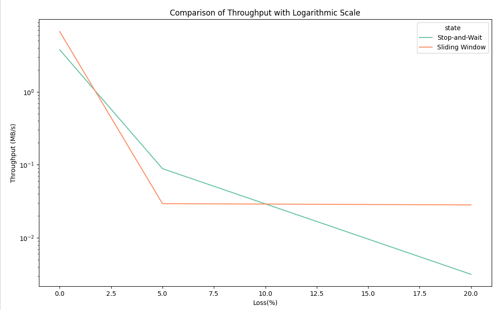
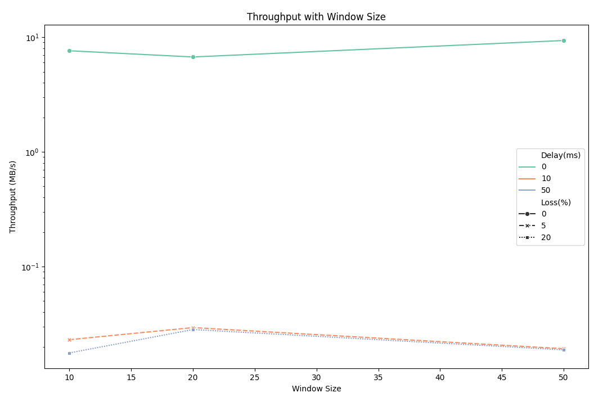
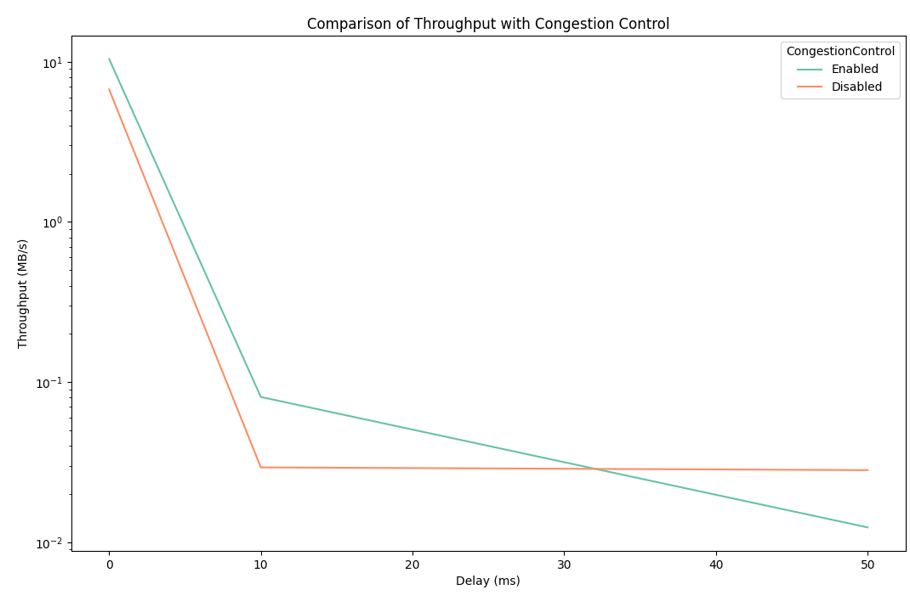

# 性能对比报告

本报告将对三种不同的传输机制进行性能对比实验，以评估它们在不同网络条件下的表现。包括停等机制与滑动窗口机制的比较、滑动窗口机制中不同窗口大小对性能的影响、以及有无拥塞控制的性能差异。通过自行在程序中添加代码，模拟不同的网络延迟和丢包率，测量吞吐率和文件传输时延作为测试指标，分析各机制的优缺点。

## 一、实验设计

### 1. 测试环境
- **操作系统**: Ubuntu22.04
- **传输协议**: UDP
- **实验数据**: 测试文件3.jpg
- **数据包大小**：4096 bytes

### 2. 性能指标
- **吞吐率**: 吞吐率是单位时间内成功传输的数据量，以 Mbps 为单位表示。
- **文件传输时延**: 文件从发送方开始到接收方完全接收到的时间，单位为秒（s）。

### 3. 实验方案
- **实验1**：停等机制与滑动窗口机制性能对比
  - 网络延迟
  - 丢包率

- **实验2**：滑动窗口机制中不同窗口大小对性能的影响
  - 窗口大小
  - 网络延迟
  - 丢包率

- **实验3**：有拥塞控制和无拥塞控制的性能比较
  - 是否启用拥塞控制
  - 网络延迟
  - 丢包率

- 延时和丢包率的设置组别一致，分别为 0ms，10ms，50ms 和 0%，5%，20%
- 每次实验组进行5次测试，计算每次的吞吐率和文件传输时延，取平均值作为数值，以保证结果的准确性。
- 绘制图表，显示 **延时**、**丢包率**、**窗口大小**、**拥塞控制** 对性能的影响。

## 二、实验结果与分析

### 1. 实验组1：**停等机制与滑动窗口机制性能对比**
比较停等机制和滑动窗口机制的吞吐率和文件传输时延，分别使用不同的延时和丢包率。滑动窗口大小固定为20。

| 测试编号 | 停等/滑动 | 延时（ms） | 丢包率 (%)| 吞吐率（MB/s） | 文件传输时延（秒） |
|----------|----------|------------|--------------|----------------|------------------|
| 1        | 停等        | 0         | 0          | 3.78089            | 3.019               |
| 2        | 滑动窗口        | 0         | 0          | 6.72181            | 1.69813               |
| 3        | 停等        | 10         | 5          | 0.0886329            | 128.784               |
| 4        | 滑动窗口        | 10         | 5          | 0.029358            | 388.805               |
| 5        | 停等        | 50         | 20         | 0.00315914            | 3613.17               |
| 6        | 滑动窗口        | 50         | 20         | 0.0282262            | 404.395               |

- 在 延时=0 ms，丢包率=0% 的情况下，滑动窗口机制的吞吐率是停等机制的 1.78 倍，传输时延减少了 43.7%。
- 在较高的延时和丢包率条件下（例如，延时=50 ms，丢包率=20%），滑动窗口机制的吞吐率虽然低，但仍是停等机制的 8.9 倍，并且文件传输时延减少了 88.8%。滑动窗口机制在高延时和高丢包率场景下显示出显著的性能优势。

- 随着延时的增加，停等机制的吞吐率下降幅度更显著，尤其在 延时=50 ms，丢包率=20% 的条件下，其吞吐率降至 0.003 MB/s。滑动窗口机制在延时增加时的吞吐率下降较缓，表明其对高延时环境具有更强的适应性。

### 2. 实验组2：**滑动窗口机制中不同窗口大小对性能的影响**
研究在滑动窗口机制下，窗口大小对吞吐率和文件传输时延的影响。窗口大小分别为10，20，50

| 测试编号 | 延时（ms） | 丢包率 (%) | 窗口大小 | 吞吐率（MB/s） | 文件传输时延（秒）
|----------|------------|------------|----------|----------------|------------
| 1        | 0         | 0          | 10        | 7.61373            | 1.4992         
| 2        | 0         | 0          | 20        | 6.72181            | 1.69813         
| 3        | 0         | 0         | 50        | 9.35629            | 2.35671         
| 4        | 10         | 5         | 10        | 0.0230326            | 495.581         
| 5        | 10        | 5         | 20        | 0.029358            | 388.805         
| 6        | 10        | 5         | 50       | 0.0192117            | 594.144           
| 7        | 50         | 20          | 10        | 0.0176533            | 564.32         
| 8        | 50         | 20         | 20        | 0.0282262            | 404.395         
| 9        | 50         | 20         | 50        | 0.0187825            | 597.613              

- 延时为 0ms，丢包率为 0%（无网络干扰）：吞吐率随着窗口大小的增大呈现非线性变化，窗口大小为 50 时达到最大值 9.35629 MB/s。
文件传输时延随窗口大小的增大略有增加，这可能是由于额外的管理开销所致。
- 延时为 10ms，丢包率为 5%（轻微网络干扰）：吞吐率在不同窗口大小下差异较小，但窗口大小为 20 时稍高（0.029358 MB/s），这表明较大的窗口能够部分缓解轻微的网络干扰。
- 延时为 50ms，丢包率为 20%（严重网络干扰）：吞吐率表现出显著下降，窗口大小为 20 时稍高（0.0282262 MB/s），但整体性能较差。
- 文件传输时延随窗口大小变化较大，窗口大小为 20 时表现较优（404.395 秒）。

### 3. 实验组 3：**有拥塞控制与无拥塞控制的性能比较**
比较有拥塞控制和无拥塞控制情况下，文件传输时延和吞吐率的变化。固定窗口大小为10，ssthresh=10

| 测试编号 | 延时（ms） | 丢包率 (%) | 拥塞控制 | 吞吐率（MB/s） | 文件传输时延（秒） |
|----------|------------|------------|----------|----------------|------------------|
| 1        | 0         | 0          | 启用     | 10.413            | 1.07442               |
| 2        | 0         | 0          | 禁用     | 6.72181        | 1.69813          |
| 3        | 10         | 5         | 启用     | 0.0807916            | 141.283               |
| 4        | 10         | 5         | 禁用     | 0.029358            | 388.805               |
| 5        | 50        | 20         | 启用     | 0.0123897            | 921.289               |
| 6        | 50        | 20         | 禁用     | 0.0282262            | 404.395               |

- 延时为 0ms，丢包率为 0%：启用拥塞控制时吞吐率显著提升（10.413 MB/s），文件传输时延也明显缩短（1.07442 秒）。
禁用拥塞控制时吞吐率和文件传输时延均表现较差（吞吐率为 6.72181 MB/s，时延为 1.69813 秒）。
- 延时为 10ms，丢包率为 5%：启用拥塞控制时，吞吐率为 0.0807916 MB/s，显著高于禁用拥塞控制的 0.029358 MB/s。
文件传输时延显著减少，启用拥塞控制时为 141.283 秒，而禁用时为 388.805 秒。
- 延时为 50ms，丢包率为 20%（严重网络干扰）：启用拥塞控制的吞吐率表现较低，为 0.0123897 MB/s，低于禁用拥塞控制的 0.0282262 MB/s。
- 文件传输时延启用拥塞控制时反而增加（921.289 秒），禁用拥塞控制时则为 404.395 秒。

## 三、总结
1. 滑动窗口机制能显著提升吞吐率，但需要优化其在高丢包率场景下的适应能力。停等机制简单可靠，但性能在高带宽场景下有明显瓶颈。
2. 窗口大小的优化需要综合考虑网络条件。无丢包环境下可使用更大的窗口，但在丢包率高的环境下应结合拥塞控制动态调整窗口大小。
3. 拥塞控制适合在低延时、低丢包环境中使用。在复杂网络环境中，需要优化拥塞控制算法以适应动态变化。
4. 在理想条件下（低延时、低丢包率），滑动窗口和拥塞控制能够显著提高传输效率。在恶劣条件下（高延时、高丢包率），停等机制可能更可靠，而滑动窗口和拥塞控制需要改进算法以减少时延。

不同场景下，传输机制需要结合实际情况进行调整。简单可靠的机制在复杂网络环境中仍有价值，而复杂的机制则需要更多的智能化改进以适应动态网络条件。