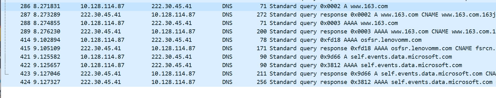

### 一、习题1-1
网络的结构如下图所示，主机A与主机B之间通过3段链路和2台路由器（R1与R2）连接，每条链路的长度和传输速率在图中标出，R1与R2采用存储转发机制，主机B向主机A发送一个长度为9000字节的报文。设电磁波在有线链路与无线链路中的传播速度分别为2×108米/秒与3×108米/秒，忽略R2与AP之间连接使用的链路，忽略报文在R1与R2的路由决策与排队的延时。

**1**. 如果采用报文交换模式，请计算报文传输的最小端到端延时（从主机B传输报文第一位开始，到主机A接收到报文最后一位所用的时间）（20分）

**2**. 如果将报文平均分成3个分组依次传输，请计算完成报文传输的最小端到端延时（忽略报文封装成分组的开销）（20分）

**3**. 如果考虑报文在路由器中的路由决策与排队过程，那么端到端延时不确定性的来源及影响最大的因素（10分）
- 排队时延：当流量大时，报文文组在路由器缓存中排队等待
- 处理时延：路由器处理报文、查找路由表等处理的时间
- 链路的容量和带宽：影响在报文链路中的传输速率

最大影响因素是排队时延，造成网络拥塞对性能影响最大

### 二、习题1-2
通过Windows命令行模式下的nslookup命令查询www.163.com，同时打开Wireshark软件捕获上述nslookup相关的DNS报文。

**1**. 提供nslookup查询结果截图，并对查询结果进行全面分析（20分）

- 本次DNS查询是通过指定的DNS服务器进行的，该服务器的IP地址为41.45.30.222
- 仿问www.163.com时，本机设备会将此域名解析为IP地址222.30.45.41
- **IPv6 地址（Addresses）**：  
  - `240e:904:800:2801:3::2f`  
  - `240e:904:800:2801:3::30`  
  - `240e:904:800:2800:3::3ec`  
  - `240e:904:800:2800:3::3eb`  

- **IPv4 地址（Addresses）**：
  - `211.100.8.109`
  - `211.100.8.104`
  - `211.100.8.105`
  - `211.100.8.106`
  - `211.100.8.110`
  - `211.100.8.107`

- **别名（Aliases）**：
  - `www.163.com`  
  - `www.163.com.163jiasu.com`  

**2**. 提供Wireshark捕获结果截图（仅过滤出DNS报文），并说明每条DNS报文的用途（20分）

过滤器栏输入dns，对数据包进行过滤
- 本机的地址是10.128.114.87，这是本地WLAN网络的ipv4地址
- 服务器地址为222.30.45.41

1. **用户发起查询**：
   - 用户在终端或应用中输入域名并请求解析（例如，使用`nslookup www.163.com`）。
2. **发送DNS查询请求**：
   - 客户端的操作系统将查询请求发送到本地配置的DNS服务器（通常是网络服务商提供的DNS服务器）。
   - 查询通常是UDP报文，发送到DNS服务器的默认端口53。
3. **本地DNS服务器处理**：
   - 本地DNS服务器接收到查询请求后，首先检查其缓存中是否有该域名的记录。
   - 如果缓存中有记录，并且记录尚未过期，则直接返回结果。
   - 如果缓存中没有记录或记录已过期，本地DNS服务器将作为DNS客户端向其他DNS服务器发起查询。
4. **递归查询**：
   - 如果本地DNS服务器没有找到答案，它将递归地查询其他DNS服务器，直到找到答案或查询失败。
   - 这通常涉及到根DNS服务器、顶级域（TLD）DNS服务器和权威DNS服务器。
5. **接收DNS响应**：
   - 权威DNS服务器接收到查询请求后，返回该域名的解析记录（如A记录、AAAA记录、CNAME记录等）。
   - 这些记录被发送回本地DNS服务器。
6. **本地DNS服务器返回结果**：
   - 本地DNS服务器将接收到的解析记录缓存起来，并将结果返回给客户端。
7. **客户端接收并处理结果**：
   - 客户端的操作系统接收到DNS响应，提取出IP地址，并将其用于后续的网络连接。
8. **客户端建立连接**：
   - 使用从DNS响应中获得的IP地址，客户端可以发起TCP连接（如果是HTTP/HTTPS请求）或其他协议的连接。

**3**. 提供某个DNS报文详细信息截图，说明DNS服务使用哪种传输层协议，以及哪些措施可提高DNS服务可靠性

选择第一条DNS报文，是一个DNS查询报文，源主机尝试解析域名www.163.com对应的IP地址。
- ```Protocol```字段中显示该DNS报文使用了UDP作为其传输层协议

提高DNS服务可靠性：
- 部署分布式 DNS：使用 Anycast 将同一 DNS 服务的 IP 地址在多个地理位置的服务器上广播。用户请求会路由到最近的服务器
- 使用缓存机制：通过 DNS 缓存减少对权威服务器的请求，提高解析效率并降低延迟。
- 防御 DNS 攻击：如启用 DNSSEC 通过数字签名验证 DNS 响应的来源，防止域名篡改。
- 配置主从 DNS 服务器：配置多个 DNS 服务器，其中一个作为主服务器，其他作为从服务器。主从服务器定期同步数据，提供冗余服务。